# User Guide

This guide explains how to use each part of Kakadoo Engine. For an overview of the project and how it's built, see the [README](../README.md). For setup and the code, see the [Maintainer Guide](maintainer-guide.md).

Kakadoo Engine finds pages on the AWS website that explain a topic, and adds a few tools around it:

- **[Search](#search)** – finds AWS pages for a topic and ranks them by relevance.
- **[AWS Fun Facts](#aws-fun-facts)** – shows a random fact about AWS.
- **[Statistics](#statistics)** – shows charts about the index.
- **[AWS Chatbot](#aws-chatbot)** – answers questions about AWS using an AI model.
- **[Admin Panel](#admin-panel)** – lets administrators manage the index.

The **index** is the engine's catalog of the AWS website: for each word, it records which pages contain it and how many times. It's built by crawling the AWS website, and search, statistics and the admin panel all work from it.

## Search

1. On the main page, click **Run Query**.

   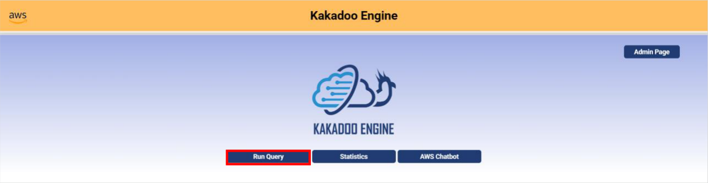

2. Type your query in the search box.
   - Queries must be in English.
   - Uppercase and lowercase letters give the same results.
   - Searching with an empty box shows an error.

   

3. Click **Search**.

   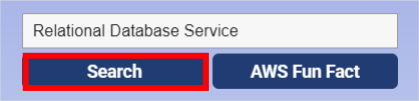

4. After a second or two, the matching pages appear, sorted from most to least relevant. Each result links to the AWS page and shows its rank.

   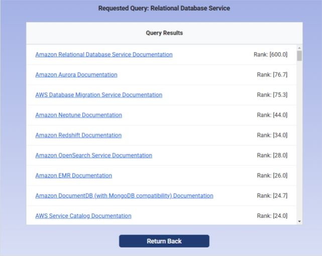

   The rank reflects how relevant the page is to your query. It's based on how often the query's words appear on the page, how many of the query's words the page contains, and whether they appear in the page's address. For the best results, write a short, precise query about an AWS topic. If nothing matches, "No Results Found" is shown.

5. To run another query, click **Return Back**. To finish, click **Return Back** and then **Return to Main Page**.

If "The search index isn't available." appears when you click **Search**, the engine isn't connected to its database, so search can't run.

## AWS Fun Facts

1. On the main page, click **Run Query** (see [Search, step 1](#search)).
2. Click **AWS Fun Fact**.

   

3. A random fact about AWS appears. Click **AWS Fun Fact** again to see a different one.

   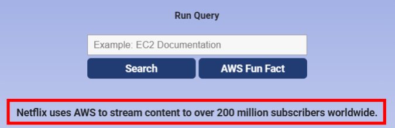

4. When you're done, click **Return to Main Page**.

## Statistics

1. On the main page, click **Statistics**.

   

2. Click a tab to switch between charts:
   - **Random Words** – how many times five randomly chosen words appear across the indexed pages. Click **Random Again** for a new set of words.
   - **Most Common Words** – the five words that appear most often.
   - **Least Common Words** – five of the rarest words. Each bar shows a different count, with a word chosen at random from the words that share that count.
   - **Most Common Documents** – the five pages that contain the most indexed words.

   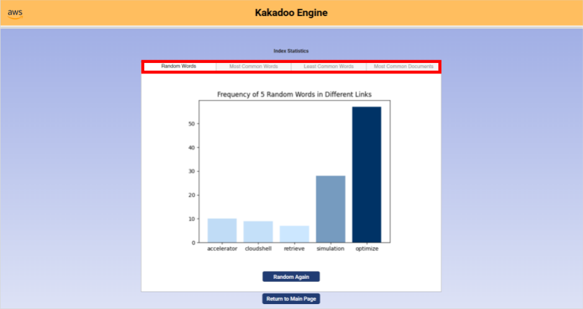

3. When you're done, click **Return to Main Page**.

If "The search index isn't available." appears instead of the charts, the engine isn't connected to its database, so statistics can't be shown.

## AWS Chatbot

1. On the main page, click **AWS Chatbot**.

   

2. Type a question about AWS in the box.

   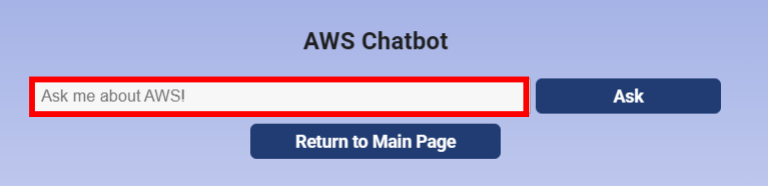

3. Click **Ask**. A short, simple answer appears below the box.
4. When you're done, click **Return to Main Page**.

Good to know:

- **The chatbot only answers questions about AWS.** Questions that don't mention AWS or an AWS-related term, such as a service name, are rejected.
- **Answers come from the AI model's general knowledge,** not from the indexed pages or live AWS data, so they may not reflect the latest changes to AWS.
- **If "The chatbot isn't configured." appears,** the chatbot isn't available in this installation.

## Admin Panel

The admin panel is for the system's administrators.

1. On the main page, click **Admin Page**.

   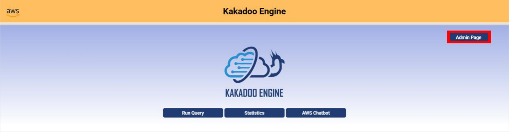

2. Enter the admin password and click **Enter**. The password for this demo is `123456`. To cancel, click **Close**.

   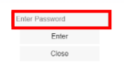

3. To see the words in the index, open the **Term** list.

   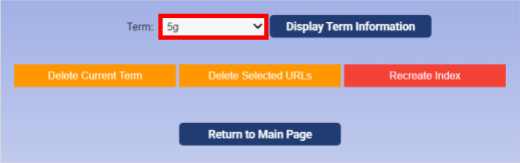

4. Select a word and click **Display Term Information** to see every page that contains it and how many times it appears there.

   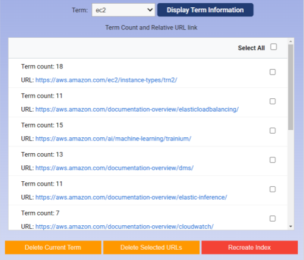

5. When you're done, click **Return to Main Page**.

If "The search index isn't available." appears instead of the password box, the engine isn't connected to its database, so the index can't be managed.

### Managing the Index

> [!WARNING]
> The following actions can't be undone.

- **Recreate Index** – deletes the current index, crawls the AWS website and builds a new index. A loading message is shown while it runs. With the default limit of 200 pages, this took about 2 minutes when the project was developed; it can take longer as the AWS website changes.

  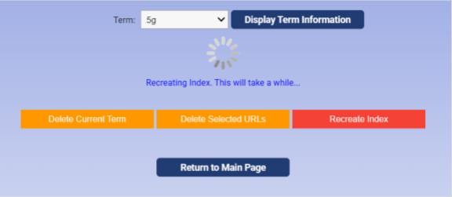

  When it finishes, "Index uploaded successfully!" appears. If it fails, "Error uploading index" appears with the reason. Check that your internet connection is stable and try again. Because the old index is deleted first, search has no results until a rebuild succeeds.

  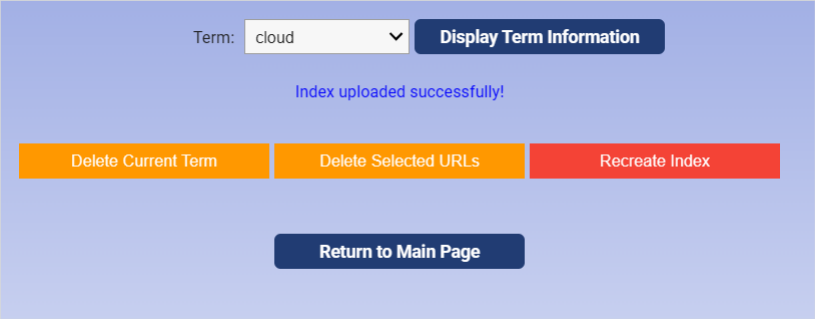

- **Delete Current Term** – removes the selected word, and its list of pages, from the index.
- **Delete Selected URLs** – removes the checked pages from the selected word. To remove most of a word's pages, check **Select All** and then uncheck the pages you want to keep. If you remove all of a word's pages, the word itself is removed too.
